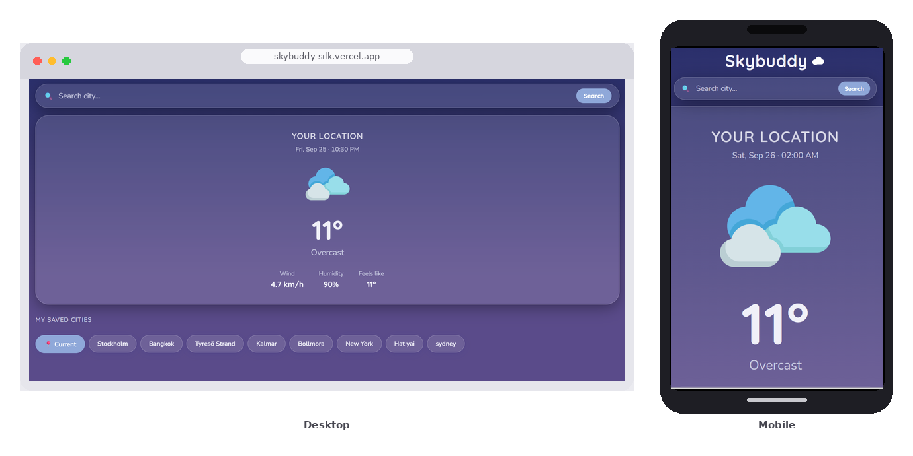
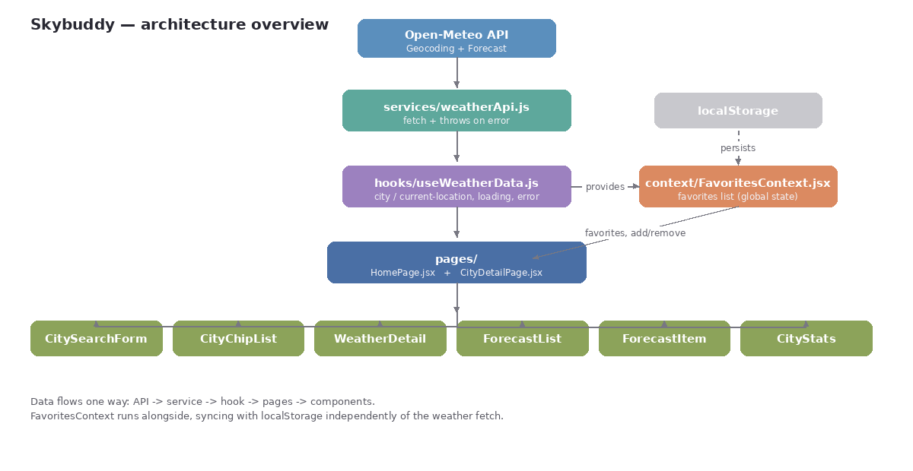
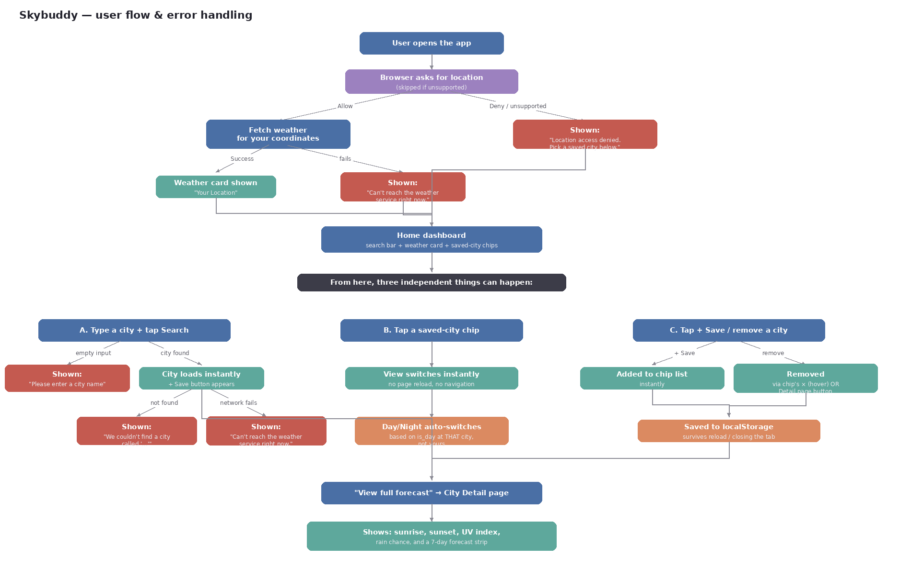

# ☁️ Skybuddy

**A weather app with a memory.** Skybuddy remembers the cities you care about, greets you with your own local forecast the moment you open it, and quietly shifts from day to night right along with the sky outside your window.And even when you're far away from home, Skybuddy keeps you close to the places and people you miss.

**🔗 Live app:** [skybuddy-silk.vercel.app](https://skybuddy-silk.vercel.app/)

---

## What is this?

Skybuddy is a single-page weather dashboard. Open it and it immediately asks for your location, pulls live weather for wherever you are, and shows it inside a soft, glass-like card that changes color palette depending on whether it's day or night at that location.

From there you can search any city in the world, preview its weather instantly, and save it to your own list with one tap. Saved cities live in a horizontally scrolling chip bar at the bottom of the screen, so switching between "how's the weather at home" and "how's the weather where my friend lives" takes exactly one click — no page reload, no waiting.

Every city also has its own detail page, reachable through routing, with a fuller picture: sunrise and sunset times, UV index, rain probability, and a 7-day forecast strip. It's the same weather engine underneath, just zoomed in.

## Screenshots



## Features

- 📍 **Location-aware by default** — uses the browser's Geolocation API to show current weather with zero input required
- 🔍 **Instant city search** — type a city name and see live conditions immediately, with a friendly message if nothing matches
- ⭐ **Favorites, done right** — add or remove cities from your list from either page; everything is saved to `localStorage`, so your list survives a page reload, a closed tab, or a restarted laptop
- 🗺️ **Two-page routing** — a fast dashboard and a fuller detail view, connected with React Router, no reloads (see below)
- 🌗 **Day/night theming** — the entire color palette shifts based on the actual time of day *at the city you're viewing*, not your own local time
- 📅 **7-day forecast** with sunrise, sunset, UV index, and rain chance on each city's detail page
- 📱 **Fully responsive** — designed mobile-first with a glassmorphism aesthetic, tested on real devices, not just DevTools
- 🧭 **Live URL for every city** — `/city/Sydney` is a real, shareable address, not just an in-memory state change

## Routing

Skybuddy uses three routes, all handled by `react-router-dom` with no full-page reloads between them:

| Route | Page | What it shows |
|---|---|---|
| `/` | `HomePage` | The dashboard — search bar, current weather (for whichever city or location is selected), and the horizontally scrolling row of saved-city chips |
| `/current` | `CityDetailPage` | Full detail view for your current geolocation — same layout as below, just without a city name in the URL |
| `/city/:cityName` | `CityDetailPage` | Full detail view for one specific saved or searched city: sunrise/sunset, UV index, rain chance, and the 7-day forecast strip |

## Tech stack

| Layer | Choice |
|---|---|
| UI framework | React (Vite) |
| Routing | React Router |
| Shared state | React Context (`FavoritesContext`) |
| Data fetching | Custom hook (`useWeatherData`) + native `fetch` |
| Weather data | [Open-Meteo](https://open-meteo.com/) — Geocoding API + Forecast API |
| Persistence | `localStorage` |
| Styling | CSS Modules |
| Deployment | Vercel |

## Project structure

```
src/
├── components/        # Presentational building blocks, one folder each
│   ├── CitySearchForm/
│   ├── CityChipList/
│   ├── WeatherDetail/
│   ├── ForecastList/
│   ├── ForecastItem/
│   └── CityStats/
├── context/
│   └── FavoritesContext.jsx   # global favorites state + localStorage sync
├── hooks/
│   └── useWeatherData.js      # shared fetch/loading/error logic for both pages
├── pages/
│   ├── HomePage.jsx           # the dashboard — search, current view, favorites
│   └── CityDetailPage.jsx     # full detail view for a single city
├── services/
│   └── weatherApi.js          # all Open-Meteo requests live here, isolated from UI
├── utils/
│   └── weatherCodes.js        # maps Open-Meteo's weather codes to text + icons
└── styles/
    └── theme.css               # shared CSS variables for both day and night themes

public/
└── weather-icons/       # weather icon set, served as static assets
```

## Architecture



## User flow & error handling



Every error state shown to the user is deliberate:

| Situation | What the user sees |
|---|---|
| Search submitted empty | "Please enter a city name" |
| City not found | "We couldn't find a city called '...'" |
| API/network failure | "Can't reach the weather service right now." |
| Location permission denied | "Location access denied. Pick a saved city below instead." |
| Geolocation unsupported | "Geolocation is not supported on this device" |

A saved city can be removed from **two places**: the × that appears on hover over its chip on the dashboard, or the "Remove from the list" button on its own detail page — the second exists specifically because hover doesn't exist on touchscreens. The "+ Save" button follows the same logic in reverse: it only appears when the city currently being viewed *isn't* already saved, from either page, since both render the same `WeatherDetail` component.

## Getting started locally

You'll need [Node.js](https://nodejs.org/) installed. No API keys, no `.env` file, no backend — Open-Meteo is free and open.

```bash
# 1. Clone the repo
git clone https://github.com/kulla-kukkai/skybuddy.git
cd skybuddy

# 2. Install dependencies
npm install

# 3. Run the dev server
npm run dev
```

Then open the URL it prints (usually `http://localhost:5173`) in your browser. When the browser asks for location access, allowing it gets you the full experience — declining it still works fine, you just land in "pick a saved city" mode instead.

## Requirements checklist

**Godkänd (G)**

- [x] 5+ clearly scoped components, each with a single responsibility
- [x] Sensible folder structure separating components, pages, and helpers
- [x] Routing between 2+ views, no full page reloads (`react-router-dom`)
- [x] State shared across components via Context, cleanly separated from local form state
- [x] External API calls with loading and error handling
- [x] A form with validation and clear user feedback
- [x] Data persisted across page reloads (`localStorage`)
- [x] Clean, consistently named, committed code
- [x] Complete submission: repo, README, deployed link

**Väl godkänd (VG)** — all five extra criteria met:

- [x] **Extended error handling** — distinct empty states and network-failure messages 
- [x] **Thoughtful architecture** — a shared custom hook (`useWeatherData`), reusable presentational components, and a hard line between data-fetching and rendering
- [x] **Responsive design** — verified on an actual phone, not only browser emulation 
- [x] **Extended functionality beyond the brief** — geolocation, a full favorites system, day/night theming, and sunrise/sunset/UV/rain-chance detail data
- [x] **A real commit history** — small, descriptive commits made throughout the weeks

## Credits

Weather data courtesy of [Open-Meteo](https://open-meteo.com/), free for non-commercial use, no API key required.

Weather icons from [Flaticon](https://www.flaticon.com/)
